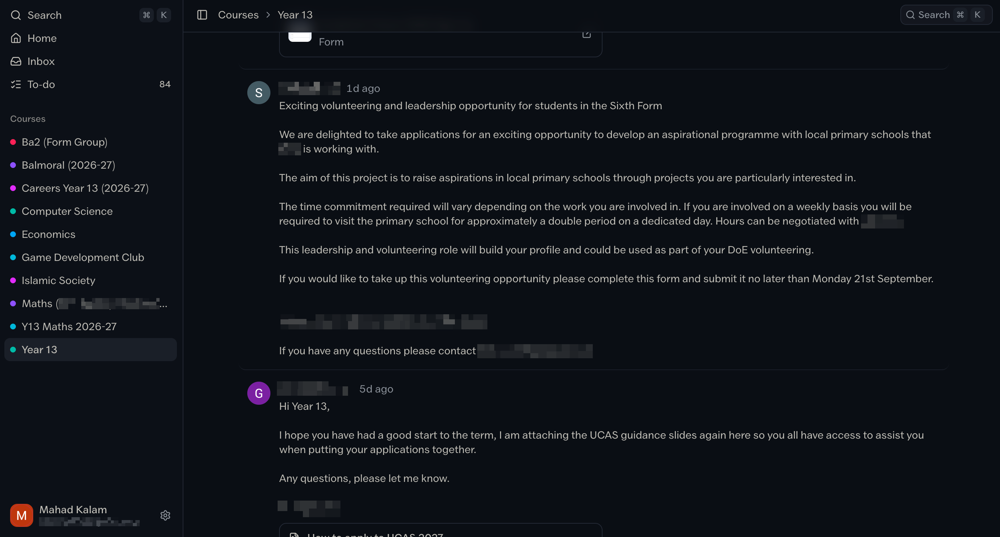

<div align="center"> 
    <br/>
    <h1>better classroom</h1>
    <p>
        
    </p>
    <p>
        a better frontend for google classroom
        <br/>
        <a href="https://mahadk.com">
            made with <3 by skyfall
        </a>
    </p>
    <!--<p>
        <a href="https://testflight.apple.com/join/8aeqD8Q2">
            testflight
        </a>
    </p>-->
    <br/>
</div>



## Running it

You need [Bun](https://bun.sh) 1.4 or newer.

```sh
bun install
cp .env.example .env        # fill in BETTER_AUTH_SECRET at least
bun run auth:migrate        # creates the account tables
bun run dev
```

Open the app, create an account at `/login`, and you land on `/setup`, which walks through connecting Google Classroom:

1. **Paste the script.** Create a new project at [script.google.com](https://script.google.com), replace its contents with `apps-script/Code.js`, and set `appsscript.json` to the manifest shown on the page.
2. **Deploy it.** Deploy → New deployment → Web app, executing as you, accessible to _Anyone_. Authorize it when asked.
3. **Connect.** Set a `CLASSROOM_SYNC_KEY` script property, then paste the deployment URL and that key into the app.

The app syncs your courses on an interval from then on. Settings has a second, optional source: paste a Classroom cookie and the app also recovers formatted post text, classmates, comments, attachments, and hand-in, none of which the API exposes.

## Deploying

Docker (primary, persistent) is defined by `Dockerfile`: a long-lived Bun
process with SQLite on disk. Set `BETTER_AUTH_SECRET` (32+ characters) and
mount `/app/data` somewhere durable.

Vercel also works: the build uses `@sveltejs/adapter-vercel` when `VERCEL`
is set (automatic on Vercel) and falls back to `node:sqlite`, since
`bun:sqlite` doesn't exist on serverless functions. Set `BETTER_AUTH_SECRET`
in the project settings; `BETTER_AUTH_URL` should be the public origin.
Caveat: serverless disks are ephemeral (`DATABASE_PATH` defaults to `/tmp`
there and auth tables are created on cold start), so sessions and caches can
vanish when instances recycle — use Docker/Fly/Railway for a persistent home.

## Scripts

| Script                 | What it does                                                   |
| ---------------------- | -------------------------------------------------------------- |
| `bun run dev`          | Dev server with hot reload                                     |
| `bun run build`        | Production build into `build/`                                 |
| `bun run start`        | Serve the production build                                     |
| `bun run check`        | Type-check the app, scripts and benches                        |
| `bun test`             | Unit tests                                                     |
| `bun run lint`         | Prettier check                                                 |
| `bun run format`       | Prettier write                                                 |
| `bun run auth:migrate` | Create or update the Better Auth tables                        |
| `bun run seed`         | Fill an account with fixture courses (`SEED_USER` picks which) |
| `bun run mock`         | Local stand-in for the Apps Script endpoint, for offline work  |
| `bun run bench`        | Search benchmark; `bun run bench:http` hits a running server   |

## Environment

Every variable is declared once in `src/env.ts`, which validates it on startup. Scripts read the same schema through `readEnv()`.

| Variable                | Required | Purpose                                                  |
| ----------------------- | -------- | -------------------------------------------------------- |
| `BETTER_AUTH_SECRET`    | yes      | Signs session cookies (32+ characters)                   |
| `BETTER_AUTH_URL`       | no       | Public origin of the app                                 |
| `GOOGLE_CLIENT_ID`      | no       | Enables "Continue with Google" on the login page         |
| `GOOGLE_CLIENT_SECRET`  | no       | Pairs with the client id                                 |
| `DATABASE_PATH`         | no       | Auth database path; user caches go in `users/` beside it |
| `SYNC_INTERVAL_MINUTES` | no       | Minutes between background syncs (default 5)             |
| `SYNC_CONCURRENCY`      | no       | Courses fetched in parallel per sync (default 2)         |
| `FULL_SYNC_HOURS`       | no       | Hours between full refetches (default 6)                 |
| `SEED_USER`             | no       | Account the seed script targets                          |
| `APPS_SCRIPT_KEY`       | no       | Key the mock server accepts                              |

## How it fits together

- **Accounts** are Better Auth in the shared SQLite file. Each signed-in user gets their own SQLite cache under `data/users/`, selected per request through an `AsyncLocalStorage` tenant context (`src/lib/server/tenant.ts`).
- **Providers** (`src/lib/server/providers.ts`) split into a record source and enrichers. The Apps Script deployment is the record source. The web session, when saved, enriches rows with what the API strips.
- **Sync** (`src/lib/server/sync.ts`) runs one scheduler for every account, diffs incoming rows against the cache, and broadcasts changes over server-sent events so open tabs update live.
- **The client** loads a snapshot on first render and then keeps TanStack DB collections in step with those events.
